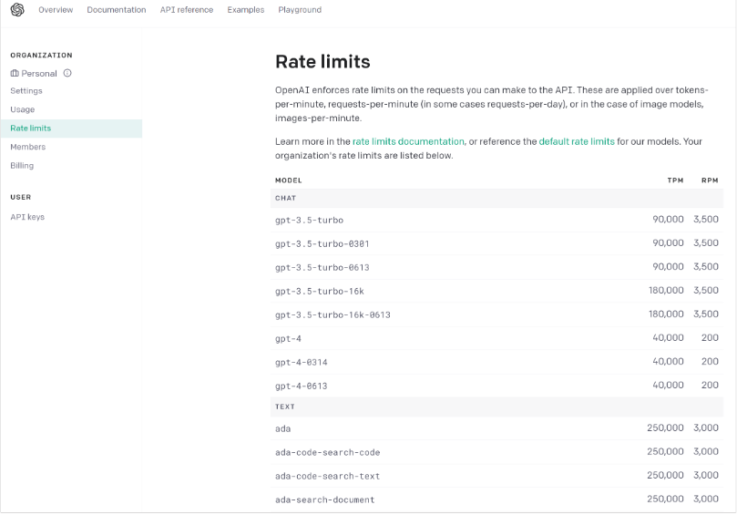

## 定义

*LangChain 是一个全方位的、基于大语言模型这种预测能力的应用开发工具*，它的灵活性和模块化特性使得处理语言模型变得极其简便。不论你在何时何地，都能利用它流畅地调用语言模型，并基于语言模型的“预测”或者说“推理”能力开发新的应用。


LangChain 支持 Python 和 JavaScript 两个开发版本。

## 入门

### 安装LangChain

`npm install langchain`


### 获取OpenAI Key

通过科学方法获取apiKey，有了 OpenAI 的账号和 Key，你就可以在面板中看到各种信息，比如模型的费用、使用情况等。下面的图片显示了各种模型的访问数量限制信息。其中，TPM 和 RPM 分别代表 tokens-per-minute、requests-per-minute。也就是说，对于 GPT-4，你通过 API 最多每分钟调用 200 次、传输 40000 个字节。



这里，我们需要重点说明的两类模型，就是图中的 Chat Model 和 Text Model。这两类 Model，是大语言模型的代表。当然，OpenAI 还提供 Image、Audio 和其它类型的模型，目前它们不是 LangChain 所支持的重点，模型数量也比较少.

- Chat Model，聊天模型，用于产生人类和 AI 之间的对话，代表模型当然是 gpt-3.5-turbo（也就是 ChatGPT）和 GPT-4。当然，OpenAI 还提供其它的版本，gpt-3.5-turbo-0613 代表 ChatGPT 在 2023 年 6 月 13 号的一个快照，而 gpt-3.5-turbo-16k 则代表这个模型可以接收 16K 长度的 Token，而不是通常的 4K。（注意了，gpt-3.5-turbo-16k 并未开放给我们使用，而且你传输的字节越多，花钱也越多）
- Text Model，文本模型，在 ChatGPT 出来之前，大家都使用这种模型的 API 来调用 GPT-3，文本模型的代表作是 text-davinci-003（基于 GPT3）。而在这个模型家族中，也有专门训练出来做文本嵌入的 text-embedding-ada-002，也有专门做相似度比较的模型，如 text-similarity-curie-001

上面这两种模型，提供的功能类似，都是接收对话输入（input，也叫 prompt），返回回答文本（output，也叫 response）。但是，它们的调用方式和要求的输入格式是有区别的。

### OpenAI-使用Text模型
第 1 步，先注册好你的 API Key。
第 2 步，用 pip install openai 命令来安装 OpenAI 库。
第 3 步，导入 OpenAI API Key。导入 API Key 有多种方式，其中之一是通过下面的代码：
`process.env.OPENAI_API_KEY = '你的Open API Key';`
为了避免在代码分享的时候把key暴露出去 最好在环境变量中设置。

第 4 步，导入 OpenAI 库，并创建一个 Client。
```js
import  OpenAI from 'apenai';
const client = OpenAI();
```

第 5 步，指定 gpt-3.5-turbo-instruct（也就是 Text 模型）并调用 completions 方法，返回结果。

```js

          const { Configuration, OpenAIApi } = require("openai");

const configuration = new Configuration({
  apiKey: process.env.OPENAI_API_KEY,
});
const openai = new OpenAIApi(configuration);

async function generateStoreName() {
  const prompt = "请给我的花店起个名";
  const model = "text-davinci-002"; // 假设这是在JavaScript中可用的模型名称
  const parameters = {
    temperature: 0.5,
    max_tokens: 100,
  };

  try {
    const response = await openai.createCompletion({
      model: model,
      prompt: prompt,
      ...parameters,
    });
    console.log(response.data.choices[0].text);
  } catch (error) {
    console.error(error);
  }
}

generateStoreName();

        
```
Text模型输入参数如下


输出参数如下


### OpenAI-调用 Chat 模型（GPT-3.5 和 GPT-4)

整体流程如上，只是在输入（prompt）和输出（response）的数据格式有所不同。

```python
response = client.chat.completions.create(  
  model="gpt-4",
  messages=[
        {"role": "system", "content": "You are a creative AI."},
        {"role": "user", "content": "请给我的花店起个名"},
    ],
  temperature=0.8,
  max_tokens=60
)
```
这段代码中，除去刚才已经介绍过的 temperature、max_tokens 等参数之外，有两个专属于 Chat 模型的概念，一个是消息，一个是角色！
先说消息，消息就是传入模型的提示。此处的 messages 参数是一个列表，包含了多个消息。每个消息都有一个 role（可以是 system、user 或 assistant）和 content（消息的内容）。
系统消息设定了对话的背景（你是一个很棒的智能助手），然后用户消息提出了具体请求（请给我的花店起个名）。模型的任务是基于这些消息来生成回复。
再说角色，在 OpenAI 的 Chat 模型中，system、user 和 assistant 都是消息的角色。每一种角色都有不同的含义和作用。
- system：系统消息主要用于设定对话的背景或上下文。这可以帮助模型理解它在对话中的角色和任务。例如，你可以通过系统消息来设定一个场景，让模型知道它是在扮演一个医生、律师或者一个知识丰富的 AI 助手。系统消息通常在对话开始时给出。user：用户消息是从用户或人类角色发出的。它们通常包含了用户想要模型回答或完成的请求。用户消息可以是一个问题、一段话，或者任何其他用户希望模型响应的内容。
- assistant：助手消息是模型的回复。例如，在你使用 API 发送多轮对话中新的对话请求时，可以通过助手消息提供先前对话的上下文。然而，请注意在对话的最后一条消息应始终为用户消息，因为模型总是要回应最后这条用户消息。

### Chat VS Text

Chat 模型和 Text 模型都有各自的优点，其适用性取决于具体的应用场景。相较于 Text 模型，Chat 模型的设计更适合处理对话或者多轮次交互的情况。这是因为它可以接受一个消息列表作为输入，而不仅仅是一个字符串。这个消息列表可以包含 system、user 和 assistant 的历史信息，从而在处理交互式对话时提供更多的上下文信息。

💬 现在的大多数场景都是Chat模型吧

### LangChain调用OpenAI

Text

```python
import os
os.environ["OPENAI_API_KEY"] = '你的Open API Key'
from langchain.llms import OpenAI
llm = OpenAI(  
    model="gpt-3.5-turbo-instruct",
    temperature=0.8,
    max_tokens=60,)
response = llm.predict("请给我的花店起个名")
print(response)
```

Chat

```python
import os
os.environ["OPENAI_API_KEY"] = '你的Open API Key'
from langchain.chat_models import ChatOpenAI
chat = ChatOpenAI(model="gpt-4",
                    temperature=0.8,
                    max_tokens=60)
from langchain.schema import (
    HumanMessage,
    SystemMessage
)
messages = [
    SystemMessage(content="你是一个很棒的智能助手"),
    HumanMessage(content="请给我的花店起个名")
]
response = chat(messages)
print(response)
```

### 其他模型
另外，大语言模型可不是 OpenAI 一家独大，知名的大模型开源社群 HugginFace 网站上面提供了很多开源模型供你尝试使用。就在我写这节课的时候，Meta 的 Llama-2 最受热捧，而且通义千问（Qwen）则刚刚开源。

## 实践

### 目标
开发一套基于各种内部知识手册的 “Doc-QA” 系统。这个系统将充分利用 LangChain 框架，处理从员工手册中产生的各种问题。这个问答系统能够理解员工的问题，并基于最新的员工手册，给出精准的答案。

### 实现

通过大量数据源输入，借助大模型产生指定内容。

lanchain处理输入文件 的核心流程为以下5步：
- Loading：文档加载器把 Documents 加载为以 LangChain 能够读取的形式。
- Splitting：文本分割器把 Documents 切分为指定大小的分割，我把它们称为“文档块”或者“文档片”。
- Storage：将上一步中分割好的“文档块”以“嵌入”（Embedding）的形式存储到向量数据库（Vector DB）中，形成一个个的“嵌入片”。
- Retrieval：应用程序从存储中检索分割后的文档（例如通过比较余弦相似度，找到与输入问题类似的嵌入片）。
- Output：把问题和相似的嵌入片传递给语言模型（LLM），使用包含问题和检索到的分割的提示生成答案。

💬 可以理解为`解析、分片、存储、匹配、投喂`
❓ 我如何通过大模型训练指定的文本数据后重复使用呢？所谓向量数据库是不是就是做这个的，我是否可以一次自定义后重复利用？

#### 重要概念-词嵌入（Word Embedding）
  词嵌入（Word Embedding）是自然语言处理和机器学习中的一个概念，它将文字或词语转换为一系列数字，通常是一个向量。
  简单地说，词嵌入就是一个为每个词分配的数字列表。这些数字不是随机的，而是捕获了这个词的含义和它在文本中的上下文。
  因此，语义上相似或相关的词在这个数字空间中会比较接近。 
  举个例子，通过某种词嵌入技术，我们可能会得到：
  “国王” -> [1.2, 0.5, 3.1, …]
  “皇帝” -> [1.3, 0.6, 2.9, …]
  “苹果” -> [0.9, -1.2, 0.3, …] 
  从这些向量中，我们可以看到“国王”和“皇帝”这两个词的向量在某种程度上是相似的，而与“苹果”这个词相比，它们的向量则相差很大，因为这两个概念在语义上是不同的。
  词嵌入的优点是，它提供了一种将文本数据转化为计算机可以理解和处理的形式，同时保留了词语之间的语义关系。这在许多自然语言处理任务中都是非常有用的，比如文本分类、机器翻译和情感分析等。

#### 重要概念-向量数据库

  向量数据库，也称为矢量数据库或者向量搜索引擎，是一种专门用于存储和搜索向量形式的数据的数据库。
  在众多的机器学习和人工智能应用中，尤其是自然语言处理和图像识别这类涉及大量非结构化数据的领域，将数据转化为高维度的向量是常见的处理方式。这些向量可能拥有数百甚至数千个维度，是对复杂的非结构化数据如文本、图像的一种数学表述，从而使这些数据能被机器理解和处理。
  然而，传统的关系型数据库在存储和查询如此高维度和复杂性的向量数据时，往往面临着效率和性能的问题。因此，向量数据库被设计出来以解决这一问题，它具备高效存储和处理高维向量数据的能力，从而更好地支持涉及非结构化数据处理的人工智能应用。

